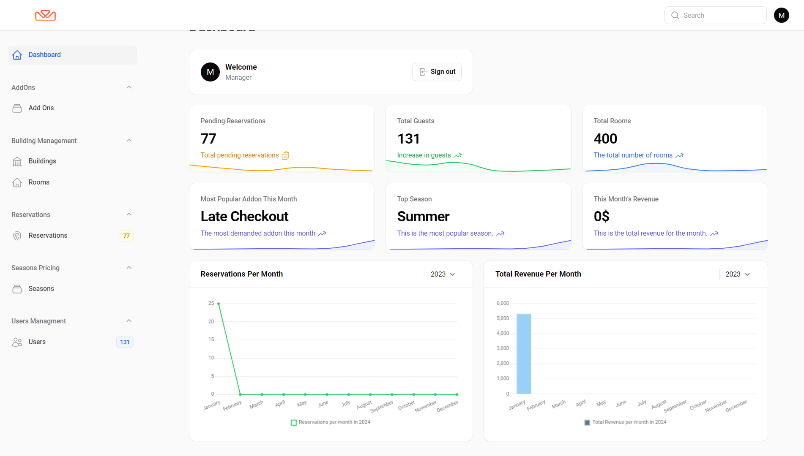
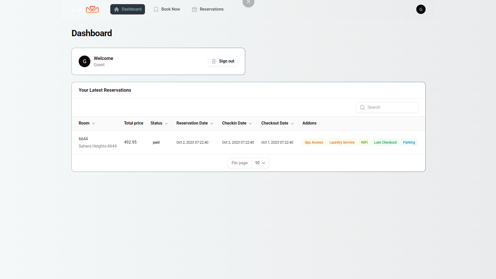
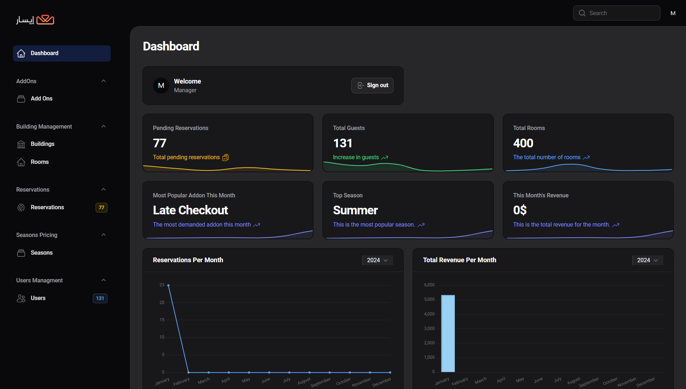
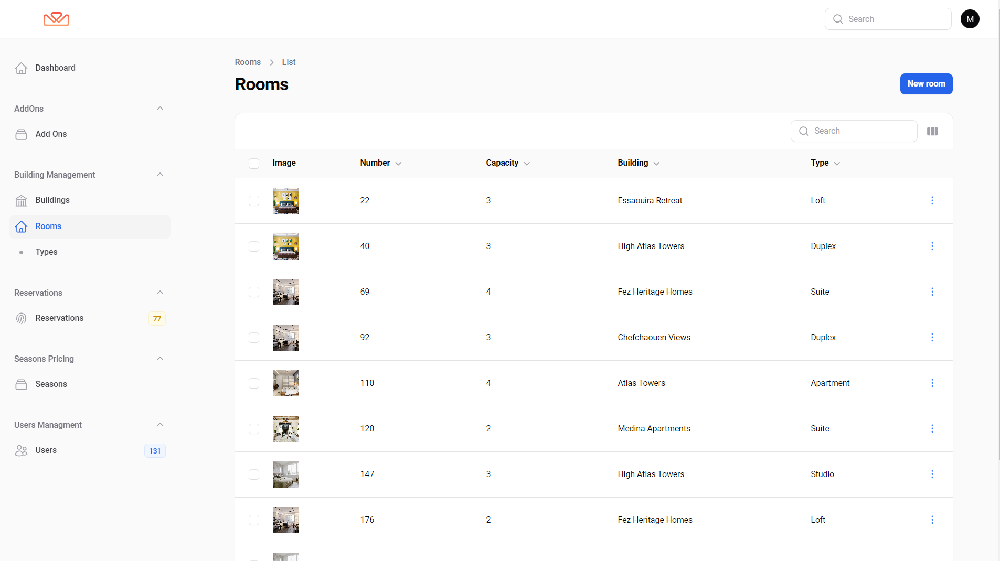
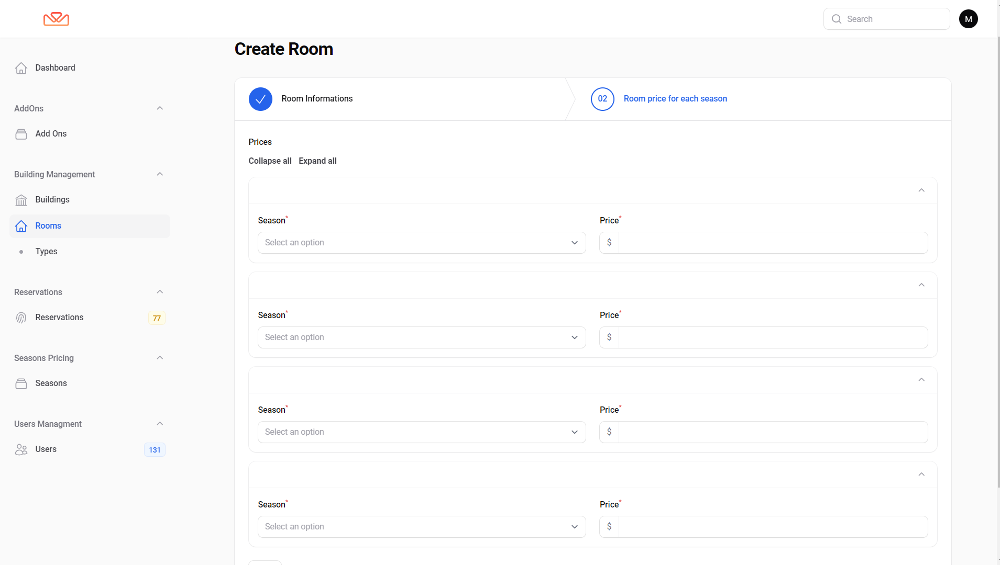
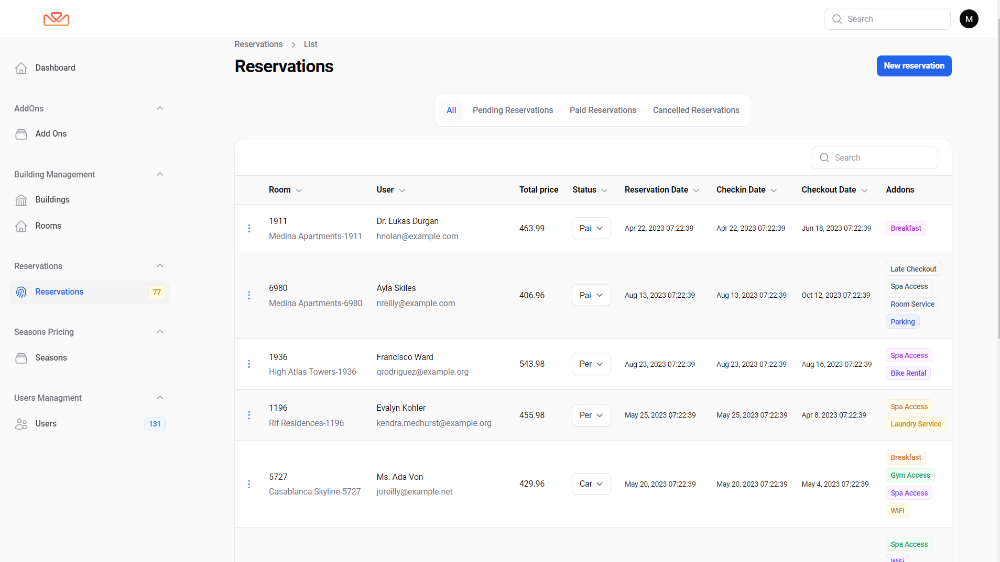
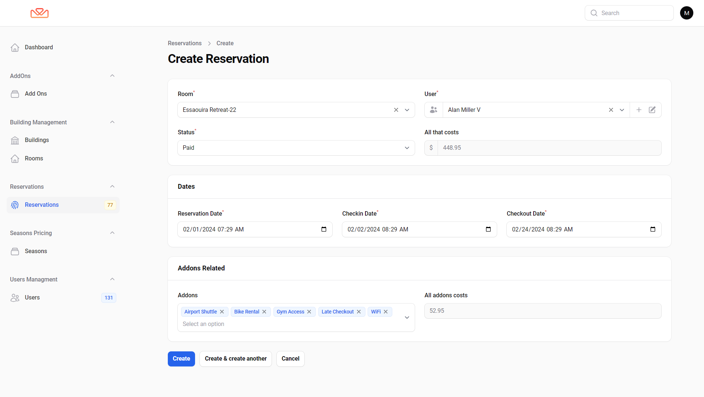
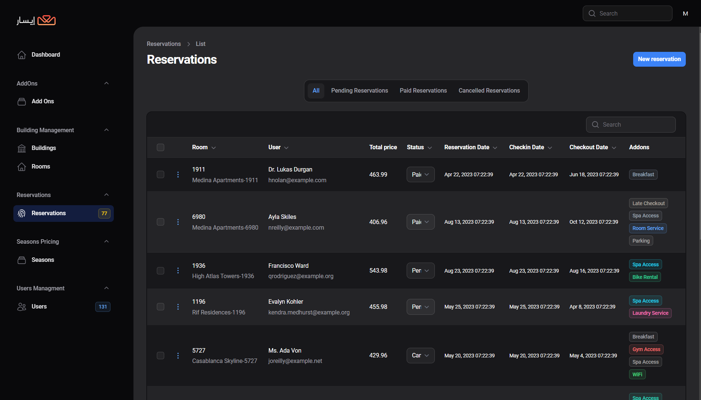
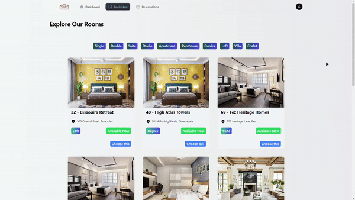

# Eisar Reserve - Room Reservation System

## Installation Steps

1. **Clone the Git repository:**

    ```bash
    git clone https://github.com/HoceineEl/EisarReserve.git
    ```

2. **Navigate to the project directory:**

    ```bash
    cd EisarReserve
    ```

3. **Copy the environment file:**

    ```bash
    cp .env.example .env
    ```

4. **Install PHP dependencies:**

    ```bash
    composer install
    ```

5. **Generate the application key:**

    ```bash
    php artisan key:generate
    ```

6. **Migrate the database with seeding:**

    ```bash
    php artisan migrate:fresh --seed
    ```

7. **Install Node.js dependencies:**

    ```bash
    npm install
    ```

8. **Build the assets:**

    ```bash
    npm run build
    ```

9. **Create a symbolic link to the storage:**

    ```bash
    php artisan storage:link
    ```

## Usage

-   Eisar Reserve is a room reservation system. Provide information on how users can interact with the system, make reservations, and manage bookings.

## Screenshots

### Dashboard

**Manager**

**Reservator**

**Guest**

**Drak Dashboard**


### Room Management





### Reservation Form




[Click here to view Reservation Form video](screenshots/res-create.mp4)



### Guest Booking



## Features

1. **Building Management:**

    - Create, view, update, and delete buildings.

2. **Room Management:**

    - CRUD operations for managing rooms within buildings.
    - Display room details, including images.

3. **Season-Based Room Pricing:**

    - Define pricing for rooms based on seasonal start and end dates.

4. **Add-On Management:**

    - CRUD operations for managing room add-ons (e.g., breakfast, massage).
    - Set prices for each add-on.

5. **Reservation Management:**

    - CRUD operations for handling reservations.
    - Pricing calculated based on booking date and selected add-ons.
    - Different reservation statuses (Pending, Paid, Canceled).

6. **User Management:**

    - CRUD operations for managing users.
    - Assign roles (Admin, Reservations Staff, Guest) to control permissions.

7. **Role-Based Access:**

    - Different roles have specific permissions.
    - Admins have full access, reservations staff manage reservations, and guests can make room requests.

8. **Interactive Forms and Tables:**

    - User-friendly forms for interactive data entry.
    - Tables for easy data visualization and management.

9. **Dashboard with Charts and Stats:**

    - Dashboard tailored to user roles.
    - Charts and statistics for insights into reservations, pricing, and other relevant data.

10. **Reservation Process:**

-   Guests can view room details and initiate reservations.
-   Reservators manage pending reservations and update status after payment.

## Credit

This system, EisarReserve, was developed by Hoceine EL Idrissi. For more information and to explore other projects, visit [Hoceine's website](https://hoceine.com).
